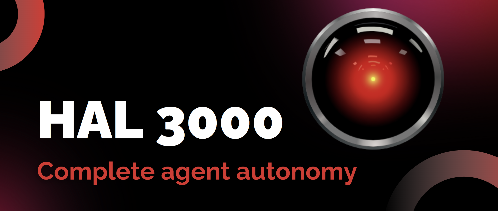
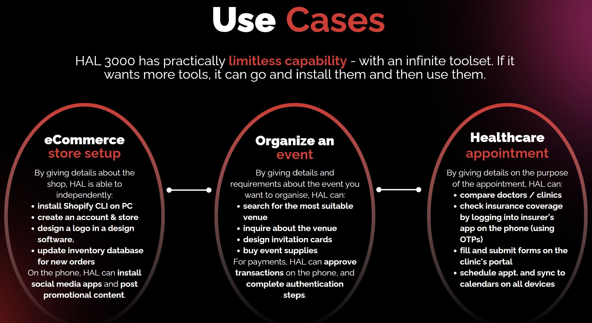
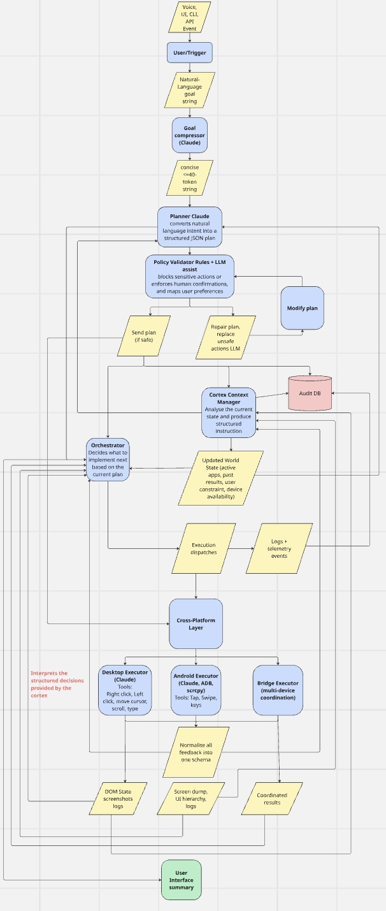
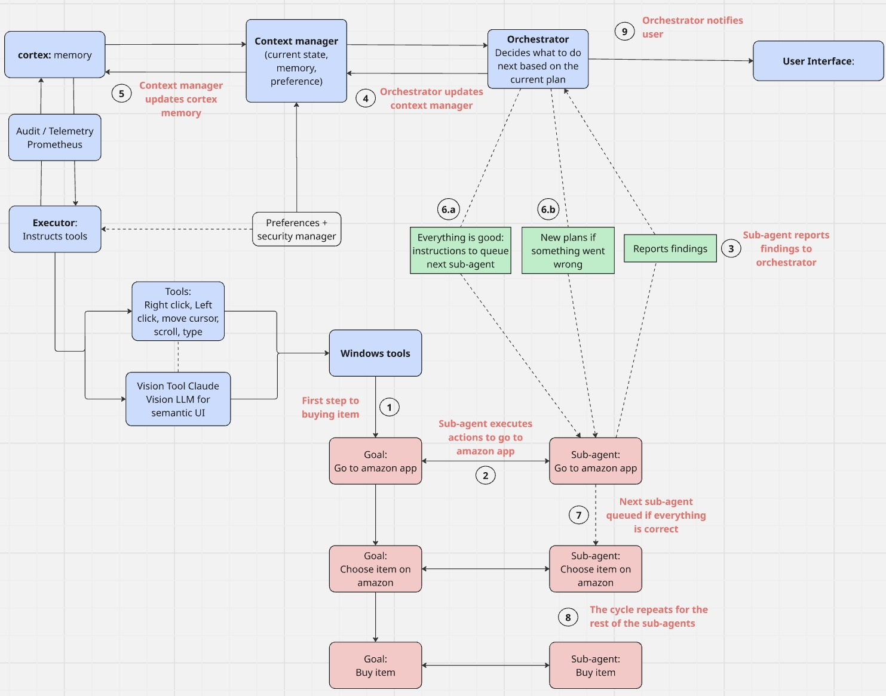
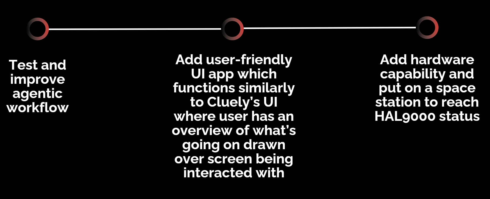

<div align="center">



</div>

# HAL 3000 🤖

**Demo Video:** [Watch HAL 3000 in Action](https://www.youtube.com/watch?v=wx5YS-XJW0E&feature=youtu.be)

HAL 3000 is an AI agent that operates like a skilled digital assistant with direct control of both your desktop and mobile devices. Instead of being confined to a chat window, HAL 3000 actually uses the same apps, tools, and services you do on Windows and Android.

## 🚀 What HAL 3000 Does

<div align="center">



</div>

- **Direct Device Control**: Opens, navigates, and interacts with apps on your computer and phone - not just API calls
- **Autonomous Tool Installation**: Installs new browser extensions, Android apps, or desktop programs as needed
- **Multi-Device Workflows**: Chains together actions across devices - search, copy, sign in, approve payments, send messages
- **Smart Preferences**: Remembers your favorite apps, delivery addresses, and approval rules
- **Secure Authentication**: Handles OTPs and mobile approvals with permission-based controls
- **Flexible Automation**: Runs autonomously or requests approval at critical points

## 🏗️ Architecture

<div align="center">



</div>

HAL 3000 uses a multi-agent architecture with specialized roles:

- **Planner**: Breaks down user requests into actionable subgoals
- **Orchestrator**: Tracks progress, marks completed tasks, and triggers replanning when needed
- **Executor**: Performs actual device interactions using computer vision
- **Cortex**: Central reasoning and decision-making hub
- **Contextor**: Maintains awareness of current state and environment

## 🔧 Technology Stack

- **Vision Models**: For screen analysis and element detection
- **Custom UI Libraries**: For cross-platform automation
- **LangChain Framework**: For agent orchestration (with custom extensions)
- **Computer Vision**: For precise UI element interaction

## 📱 Supported Platforms

<div align="center">



</div>

### Android (HAL3000Android_v2)
- Natural language mobile automation
- UI-aware app navigation
- Global #1 open-source performance on AndroidWorld benchmark
- Data extraction and structuring

### Windows (HAL3000Windows)
- Direct Windows GUI interaction
- Shell command execution
- Application automation
- Compatible with Windows 7-11

## 🛠️ Installation

### Prerequisites
- Python 3.12+
- UV package manager (or pip)
- Windows 7+ (for Windows agent)
- Android device with ADB enabled (for Android agent)

### Quick Start

```bash
# Clone the repository
git clone https://github.com/bonusducks777/HAL3000.git
cd HAL3000

# Install Android agent
cd HAL3000Android_v2
uv pip install -r requirements.txt

# Install Windows agent
cd ../HAL3000Windows
uv pip install -r requirements.txt
```

## 🎯 Inspiration

HAL 3000 was inspired by:
- The rise of agentic AI and tools like ChatGPT agent
- The potential for truly autonomous digital assistants
- HAL 9000 from 2001: A Space Odyssey (but friendlier! 😄)

## 🏆 Achievements

- Designed complete agent framework from scratch
- Built automation tools for both Android and Windows
- Achieved working agentic system for Android in hackathon timeframe
- Global #1 open-source performance on AndroidWorld benchmark

## 🚧 Challenges & Solutions

- **Cerebras LangChain Compatibility**: Built custom agentic framework
- **Time Constraints**: Rapid prototyping of complex multi-agent system
- **Cross-Platform Coordination**: Unified architecture for different OS types

## 🔮 What's Next

<div align="center">



</div>

- **Full Integration**: Complete orchestrator coordination between Android and Windows
- **User Interface**: Cluely-style UI with visual overlay showing agent actions
- **Hardware Integration**: Enhanced capabilities for IoT and embedded systems
- **Space Station Deployment**: Reaching true HAL 9000 status! 🚀

## 📄 License

This project is licensed under the MIT License - see the [LICENSE](LICENSE) file for details.

## 🤝 Contributing

We welcome contributions! Please see [CONTRIBUTING.md](CONTRIBUTING.md) for guidelines.

---

*"I'm sorry Dave, I'm afraid I can't do that... just kidding! HAL 3000 is here to help!"* 🤖